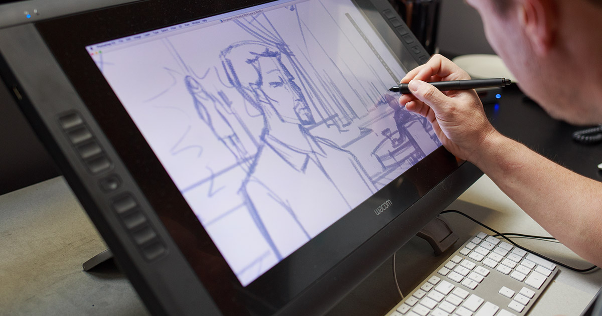
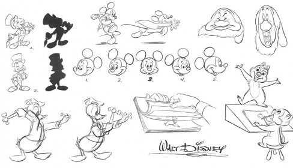
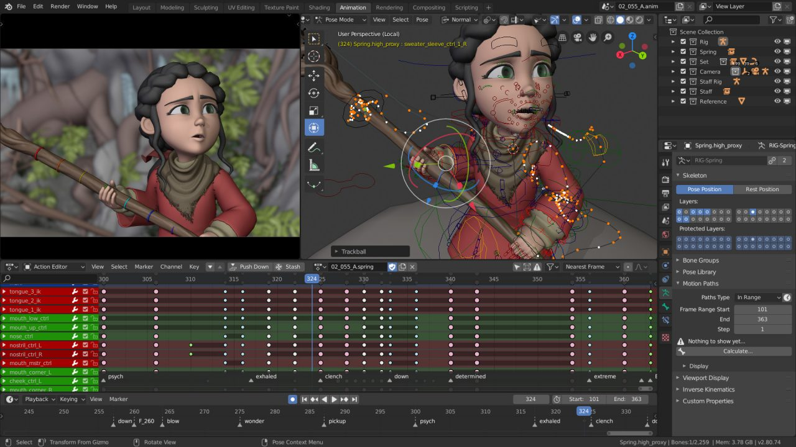
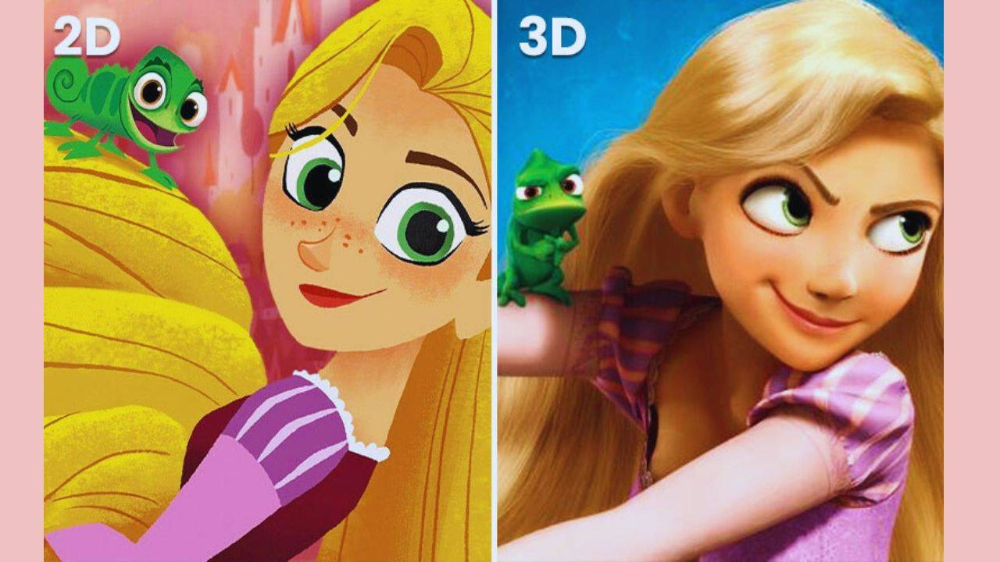

## Animação 2D vs 3D 

### Introdução 
Este projeto tem como objetivo explorar, comparar e compreender as duas principais técnicas de animação digital e tradicional: o 2D (Bidimensional) e o 3D (Tridimensional). Vamos analisar as diferenças estéticas, os processos de produção, as ferramentas utilizadas e o impacto de cada uma na indústria do entretenimento.

### O que é a Animação 2D?

A animação 2D desenrola-se num espaço plano (eixos X e Y), onde as imagens têm apenas largura e altura. É a técnica clássica que deu origem à indústria da animação.

Princípio Básico: Criação de ilusão de movimento através de uma sequência rápida de imagens estáticas (fotogramas ou frames), tradicionalmente desenhadas à mão quadro a quadro.

Exemplos Clássicos: Branca de Neve e os Sete Anões (Disney), A Viagem de Chihiro (Studio Ghibli).

Estilos Comuns: Animação tradicional em papel, animação vetorial (ex: Toon Boom, Adobe Animate) e motion graphics.

### O que é a Animação 3D?
A animação 3D passa-se num espaço virtual tridimensional (eixos X, Y e Z), onde os objetos e personagens possuem largura, altura e profundidade.

Princípio Básico: Modelação de objetos digitais em malhas poligonais, aplicação de texturas, iluminação e rigidez esquelética (rigging), permitindo que os animadores movimentem as personagens num ambiente virtual.

Exemplos Clássicos: Toy Story (Pixar/Disney), Shrek (DreamWorks).

Software Principal: Blender, Maya, Cinema 4D, 3ds Max.

### Vantagens e desvantagens

**2D – Prós:**

Mais barata e rápida de produzir.
Estilo artístico livre e expressivo (ideal para storytelling emocional).
Fácil de atualizar e adaptar.
Excelente para vídeos explicativos, educação, marketing, redes sociais e desenhos animados.
Menor barreira de entrada.

**2D – Contras:**

Menos realismo e profundidade.
Limitações de ângulos de câmera e movimentos complexos.
Assets menos reutilizáveis.

**3D – Prós:**

Realismo, volume e imersão altos.
Câmera totalmente livre e movimentos naturais.
Modelos reutilizáveis (grande vantagem em séries, jogos e produtos).
Ideal para cinema, jogos, arquitetura, simulações médicas/engenharia e realidade virtual.

**3D – Contras:**

Mais cara e demorada.
Exige equipe mais especializada e hardware potente.
Pode ficar “frio” ou genérico se não houver direção artística forte.

### Usos por indústria

**Marketing e publicidade:** 2D domina (rápido e barato); 3D para produtos premium ou demos.
**Educação e e-learning:** 2D (clareza); 3D para anatomia ou processos complexos.
**Cinema e séries:** Ambos (2D para estilo artístico; 3D para blockbusters).
**Jogos:** Predominantemente 3D; 2D em indie e pixel art.
Arquitetura e produto: Quase sempre 3D.

### Conclusão:
Não existe uma técnica “melhor” de forma absoluta. A 2D vence em agilidade, custo e liberdade artística. A 3D vence em realismo, flexibilidade de câmera e reutilização. A decisão deve ser baseada no objetivo do projeto, no orçamento e no efeito visual desejado.